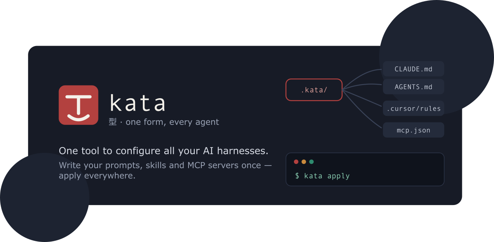

<!-- markdownlint-disable MD041 -->



# kata

> One tool to configure all your AI harnesses / agents.
> Define it once, perform it everywhere!

_**kata** - English /ˈkɑːtə/, Japanese 型 [ka̠ta̠] - a martial-arts form drilled
until it's second nature._

Every AI coding tool wants its own config: `CLAUDE.md`, `AGENTS.md`,
`.cursor/rules`, `.mcp.json`, `.codex/config.toml`, and more. Keeping them in
sync by hand is tedious and error-prone.

**kata** lets you write instructions, MCP servers, prompts, skills, and
subagents once in a `.kata/` directory, then compiles them into each tool's
native format - like Babel or Terraform, but for agent configs.

- [Guide](./packages/docs/guide/what-is-kata.md) - what kata is and how it works
- [Kata format](./packages/docs/guide/kata-format.md) - everything `.kata/` supports
- [CLI reference](./packages/docs/reference/cli.md) - every command and flag
- [ROADMAP.md](./ROADMAP.md) - planned work

## How it works

1. `kata init` scaffolds `.kata/` and detects which tools are installed.
2. You describe your customization once, in `.kata/`.
3. `kata plan` shows exactly which native files would be created or updated, with diffs.
4. `kata apply` writes them.

Output is deterministic and idempotent: the same `.kata/` always produces
byte-identical native files, so a second `plan` reports no changes and git
diffs stay clean. Content you hand-edit outside the `<!-- kata:begin/end -->`
managed regions is never touched, and JSON configs are merged rather than
overwritten.

## Quick start

Install the CLI (requires Node ≥ 24):

```sh
npm install -g @katahq/cli
```

Or run it without installing: `npx @katahq/cli <command>`.

Then, in a project you want to configure:

```sh
kata init                       # scaffold .kata/, detect installed tools
$EDITOR .kata/instructions/base.md
kata plan                       # preview native files, with diffs
kata apply                      # write them
```

Or configure every project at once via the user-level `~/.kata/`:

```sh
kata init --global
$EDITOR ~/.kata/instructions/base.md
kata apply --global             # emits ~/.claude/CLAUDE.md, ~/.codex/config.toml, …
```

## Commands

| Command                                           | What it does                                             |
| ------------------------------------------------- | -------------------------------------------------------- |
| `kata init`                                       | Scaffold `.kata/` and detect installed tools             |
| `kata add mcp\|instruction\|prompt\|agent\|skill` | Add an artifact to `.kata/`                              |
| `kata plan`                                       | Dry run: show native files to create/update, with diffs  |
| `kata apply`                                      | Write native config for every enabled target             |
| `kata status`                                     | Detect drift; exits non-zero when out of sync (CI gate)  |
| `kata import`                                     | Ingest existing native configs into `.kata/`             |
| `kata install`                                    | Install a shared config package (git URL or `npm:<pkg>`) |
| `kata watch`                                      | Re-apply whenever `.kata/` changes                       |
| `kata doctor`                                     | Check env vars, MCP commands, capability warnings        |
| `kata targets list\|enable\|disable`              | Manage which targets are enabled                         |

Every command except `import` also accepts `-g, --global` to operate on the
user-level `~/.kata/`. Secrets are referenced as `${env:VAR}` in `.kata/` and
rendered to each tool's native expansion syntax - never inlined into a
committed file.

## Targets

Adapters for Claude Code, Codex CLI, GitHub Copilot CLI, Cursor, Gemini CLI,
OpenCode, and VS Code. Each declares its capabilities and reports lossy
mappings in `plan`/`apply` output rather than dropping them silently. See the
[adapter reference](./packages/docs/reference/adapters.md) for the full
capability matrix. Community adapters can ship as `kata-adapter-*` npm packages.

## Repository layout

- `packages/core` - kata schema (zod), project loader, planner/applier, adapter
  interface, managed-region + JSON-merge write strategies.
- `packages/cli` - the `kata` command-line tool (built on [oclif](https://oclif.io)).
- `packages/adapters/*` - one adapter per target tool.
- `packages/docs` - VitePress documentation site.

## Development

```sh
npm run build        # build all workspaces
npm run typecheck
npm run lint
npm test             # vitest
npm run docs:build   # build the docs site
```

Requires Node ≥ 24 (pinned in `.node-version`); uses npm workspaces.

## License

[MIT](./LICENSE) © Tiago Santos
