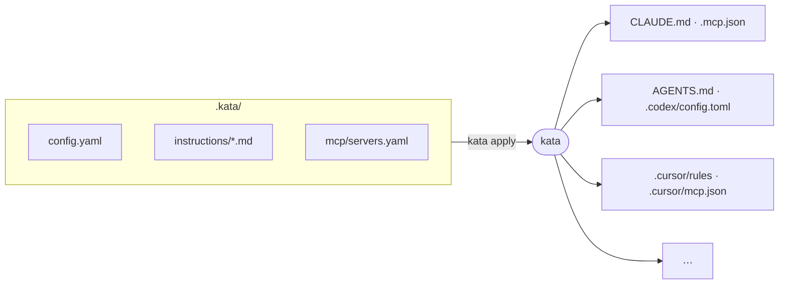

# What is kata?

_**kata** - English /ˈkɑːtə/, Japanese 型 [ka̠ta̠] - a martial-arts form drilled
until it's second nature._

Every agent harness - Claude Code, Codex CLI, Gemini CLI, Cursor, Copilot CLI -
supports customization: instruction files (`CLAUDE.md`, `AGENTS.md`,
`.cursor/rules`), MCP server configs, prompts, skills, and settings. The
concepts overlap heavily, but the file names, locations, and formats all
diverge.

Today, a customization written for one tool has to be manually ported to every
other tool. That's error-prone, unscalable, and unshareable.

**kata** gives you a single source of truth for agent
customization, compiled by adapters into each tool's native format - think
Babel or Terraform, but for agent configs.

## How it works

1. You describe instructions and MCP servers once, in `.kata/`.
2. `kata plan` shows exactly which native files would be created or
   updated, with diffs.
3. `kata apply` writes them.

Output is deterministic and idempotent: the same `.kata/` input always
produces byte-identical native files, so a second `plan` reports no changes
and git diffs stay clean.

## The team story

Commit `.kata/` to your repo. Each teammate runs `kata apply`, and
whichever harness they personally use gets configured. The repo stops caring
which agent each developer prefers.

## Lossy translation is explicit

When a target can't express something (say, a tool without MCP support), the
adapter reports it as a warning in `plan`/`apply` output instead of silently
dropping it. Capabilities are declared per adapter - see
[Adapters](/reference/adapters).

## Current status

Supported today:

- **Artifacts:** instructions, MCP servers, prompts, skills, subagents
- **Scopes:** project (`.kata/`) and global (`~/.kata/` via `--global`),
  including per-server `scope: global` routing - see
  [Scopes](/guide/kata-format#scopes)
- **Targets:** Claude Code, Codex CLI, GitHub Copilot CLI, Cursor, Gemini CLI,
  OpenCode, VS Code - plus [community adapter plugins](/guide/sharing#adapter-plugins)
- **Commands:** `init`, `add mcp`, `plan`, `apply`, `status`, `doctor`,
  `import`, `install`, `watch`, `targets`
- **Sharing:** [config packages](/guide/sharing) composed from git or npm,
  with deterministic local overrides

On the roadmap: hooks/settings artifacts, `import --global`, standalone
binaries.
